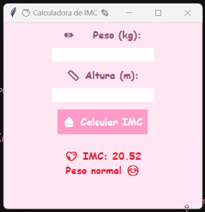

# Calculadora de IMC  

App feito com Python e Tkinter para calcular IMC.

##  Features
- Converte vírgulas em pontos automaticamente
- Classificação do IMC com emojis
- Design fofinho em tons de rosa
- Mensagens de erro personalizadas

##  Demonstração


##  Como Executar
```bash
python3 calculadoraIMC.py
```

##  Aprendizados
- Trabalhar com interfaces gráficas no Tkinter
- Validação de entrada de usuário

